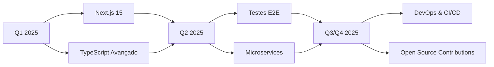

<div align="center">
  
</div>

<div align="center">
  
  
  
</div>

<br/>

## 🚀 Sobre Mim

Sou um **Desenvolvedor Full Stack** apaixonado por criar soluções digitais que fazem diferença.  Especializado em React e Node.js, transformo ideias complexas em aplicações web escaláveis, responsivas e de alta performance.

```typescript
const anderson:  Developer = {
  nome: "Anderson Jr",
  cargo: "Full Stack Developer",
  localizacao: "Brasil 🇧🇷",
  
  code: ["JavaScript", "TypeScript", "Python", "HTML", "CSS"],
  
  technologies: {
    frontend: {
      js: ["React", "Next.js"],
      css: ["Tailwind CSS", "Styled Components", "CSS3"]
    },
    backend: {
      js: ["Node.js", "Express.js"],
      python: ["FastAPI"]
    },
    databases: ["MongoDB", "PostgreSQL"],
    devOps: ["Git", "GitHub Actions", "Vercel", "Docker"],
    tools: ["VS Code", "Postman", "Figma", "Chrome DevTools"]
  },
  
  architecture: ["SPA", "REST API", "MVC", "Microservices", "Responsive Design"],
  
  currentFocus: "Building scalable web applications with React & Node.js",
  
  learning: ["Next.js 15", "TypeScript Advanced Patterns", "Testing"],
  
  goals2025: [
    "Contribute to major open source projects",
    "Master Next.js and TypeScript",
    "Build production-ready microservices"
  ],
  
  funFact: "I debug with console.log and I'm not ashamed!  🐛☕"
};
```

### 🎯 Quick Facts

- 🔭 Desenvolvendo aplicações web modernas e escaláveis
- 🌱 Explorando **Next.js**, **TypeScript avançado** e **Testes automatizados**
- 💡 Focado em **código limpo**, **performance** e **experiência do usuário**
- 🤝 Aberto para colaborações, freelance e oportunidades
- 📧 **Email:** alsj1520@gmail.com

<br/>

## 🔗 Conecte-se Comigo

<div align="center">
  <a href="https://www.linkedin.com/in/andersonjr667" target="_blank">
    
  </a>
  <a href="mailto:alsj1520@gmail. com" target="_blank">
    
  </a>
  <a href="https://wa.me/5531971533882" target="_blank">
    
  </a>
  <a href="https://github.com/andersonjr667" target="_blank">
    
  </a>
</div>

<br/>

## 📊 GitHub Analytics

<div align="center">
  
  
</div>

<div align="center">
  
</div>

<br/>

## 🛠️ Tech Stack

### 💻 Frontend


### ⚙️ Backend


### 🔧 Tools & DevOps


<br/>

## 🎯 Projetos em Destaque

### 💪 MaxFit
> Plataforma completa de gestão fitness com sistema de treinos e acompanhamento


**Principais Recursos:**
- 📋 Criação e gerenciamento de treinos personalizados
- 📈 Acompanhamento de progresso em tempo real
- 👥 Sistema de gestão de alunos e instrutores
- 📊 Relatórios e analytics detalhados
- 📱 100% responsivo e mobile-first

[Ver Repositório](https://github.com/andersonjr667/maxfit)

---

### 🏗️ Thiago Vieira Arquitetura
> Website profissional de portfólio para escritório de arquitetura


**Principais Recursos:**
- 🎨 Design elegante e minimalista
- 🖼️ Galeria de projetos interativa
- 📱 Totalmente responsivo
- ⚡ Performance otimizada (98+ Google Lighthouse)
- 🎯 SEO otimizado

[Ver Repositório](https://github.com/andersonjr667/thiago-vieira-arquitetura)

---

<div align="center">
  <a href="https://github.com/andersonjr667? tab=repositories">
    
  </a>
</div>

<br/>

## 📈 Atividade de Contribuição

<div align="center">
  
</div>

<br/>

<div align="center">
  <picture>
    <source media="(prefers-color-scheme: dark)" srcset="https://raw.githubusercontent.com/andersonjr667/andersonjr667/output/github-contribution-grid-snake-dark.svg">
    <source media="(prefers-color-scheme: light)" srcset="https://raw.githubusercontent.com/andersonjr667/andersonjr667/output/github-contribution-grid-snake.svg">
    
  </picture>
</div>

<br/>

## 🎓 Roadmap de Aprendizado 2025



### 🔄 Atualmente Focado
- ⚛️ **Next.js 15** - App Router, Server Components, Server Actions
- 🔷 **TypeScript** - Advanced Types, Generics, Design Patterns
- 🧪 **Testing** - Jest, Vitest, Testing Library, Playwright

### 🎯 Próximos Objetivos
- 🏗️ **Arquitetura** - Microservices, Event-Driven Architecture
- 🚀 **DevOps** - Docker, Kubernetes, CI/CD Pipelines
- 🌟 **Open Source** - Contribuições significativas para projetos grandes

<br/>

## 💼 Competências Principais

<table>
  <tr>
    <td align="center" width="33%">
      <h3>🎨 Frontend</h3>
      <ul align="left">
        <li>React & React Hooks</li>
        <li>State Management</li>
        <li>Responsive Design</li>
        <li>Performance Optimization</li>
        <li>Accessibility (A11y)</li>
        <li>Modern CSS (Tailwind, Styled)</li>
      </ul>
    </td>
    <td align="center" width="33%">
      <h3>⚙️ Backend</h3>
      <ul align="left">
        <li>RESTful API Design</li>
        <li>Database Design & Optimization</li>
        <li>Authentication & Authorization</li>
        <li>API Security Best Practices</li>
        <li>Server-Side Rendering</li>
        <li>Data Modeling</li>
      </ul>
    </td>
    <td align="center" width="33%">
      <h3>🚀 DevOps & Soft Skills</h3>
      <ul align="left">
        <li>Git & GitHub Workflows</li>
        <li>CI/CD Pipelines</li>
        <li>Cloud Deployment</li>
        <li>Agile/Scrum</li>
        <li>Code Review</li>
        <li>Problem Solving</li>
      </ul>
    </td>
  </tr>
</table>

<br/>

## 🤝 Contribuições Open Source

<div align="center">
  
</div>

<br/>

Acredito no poder da comunidade open source e busco contribuir regularmente: 

- 🐛 **Bug Fixes** - Identificação e correção de problemas
- 📚 **Documentação** - Melhorias e traduções
- ✨ **Features** - Implementação de novas funcionalidades
- 🧪 **Testing** - Adição de testes e melhoria de cobertura
- 💡 **Code Review** - Revisão e feedback construtivo

*Interessado em colaborar em algum projeto?  Fique à vontade para me contatar!*

<br/>

## 📬 Entre em Contato

<div align="center">
  <p>💬 Estou sempre aberto para discutir projetos, oportunidades ou apenas trocar ideias sobre tecnologia!</p>
  
  <a href="mailto:alsj1520@gmail.com">
    
  </a>
  <a href="https://www.linkedin.com/in/andersonjr667">
    
  </a>
  <a href="https://wa.me/5531971533882">
    
  </a>
</div>

<br/>

---

<div align="center">
  
  
  <h3>💚 Obrigado pela visita! </h3>
  <p>Se você gostou do meu trabalho, considere dar uma ⭐ nos repositórios!</p>
  
  <br/>
  
  
  
  
</div>
